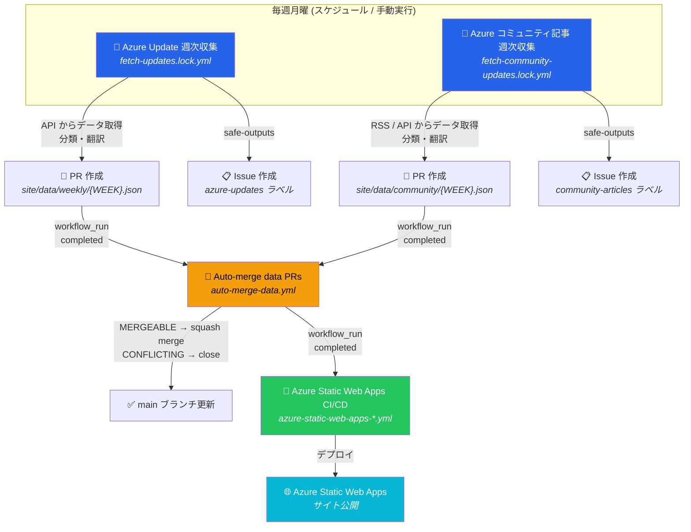
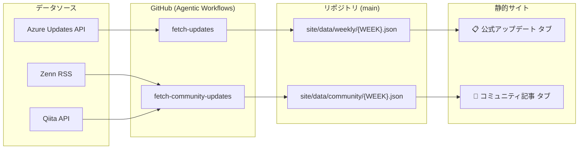

# Azure Update Curation
このワークスペースでは、Azure に関するアップデート情報を集約する静的 Web サイトのコードとコンテンツを管理する。

## やること
1. 週次の GitHub Actions ワークフロー（Agentic Workflows）を実行し、対象とするサイトから前週のアップデート情報を取得する
2. 取得した内容を標準化して JSON ファイルとして PR を作成し、自動マージ後に静的 Web サイトへデプロイする

## 対象データソース

| ソース | URL | ワークフロー |
|--------|-----|-------------|
| Azure 公式アップデート | `https://www.microsoft.com/releasecommunications/api/v2/azure` | Azure Update 週次収集 |
| Zenn (Microsoft publication) | `https://zenn.dev/p/microsoft` | Azure コミュニティ記事 週次収集 |
| Qiita (Microsoft org) | `https://qiita.com/organizations/microsoft` | Azure コミュニティ記事 週次収集 |

## ワークフロー全体像

## データフロー

## ワークフロー一覧

| ワークフロー | ファイル | トリガー | 概要 |
|-------------|---------|---------|------|
| Azure Update 週次収集 | `fetch-updates.md` / `.lock.yml` | 毎週月曜 / 手動 | Azure 公式 API から前週のアップデートを取得し、PR + Issue を作成 |
| Azure コミュニティ記事 週次収集 | `fetch-community-updates.md` / `.lock.yml` | 毎週月曜 / 手動 | Zenn・Qiita から前週の記事を取得し、PR + Issue を作成 |
| Auto-merge data PRs | `auto-merge-data.yml` | 上記ワークフロー完了後 | データ更新 PR を自動 squash merge（conflict は自動 close） |
| Azure Static Web Apps CI/CD | `azure-static-web-apps-*.yml` | push to main / auto-merge 完了後 | `./site` を Azure Static Web Apps にデプロイ |

## 競合回避

| 項目 | fetch-updates（公式） | fetch-community-updates（コミュニティ） |
|------|----------------------|----------------------------------------|
| 出力ディレクトリ | `site/data/weekly/` | `site/data/community/` |
| Issue ラベル | `azure-updates` | `community-articles` |
| ネットワーク許可 | `microsoft.com`, `azure.microsoft.com` | `zenn.dev`, `qiita.com` |
